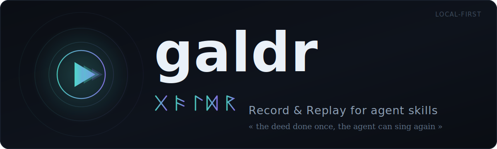
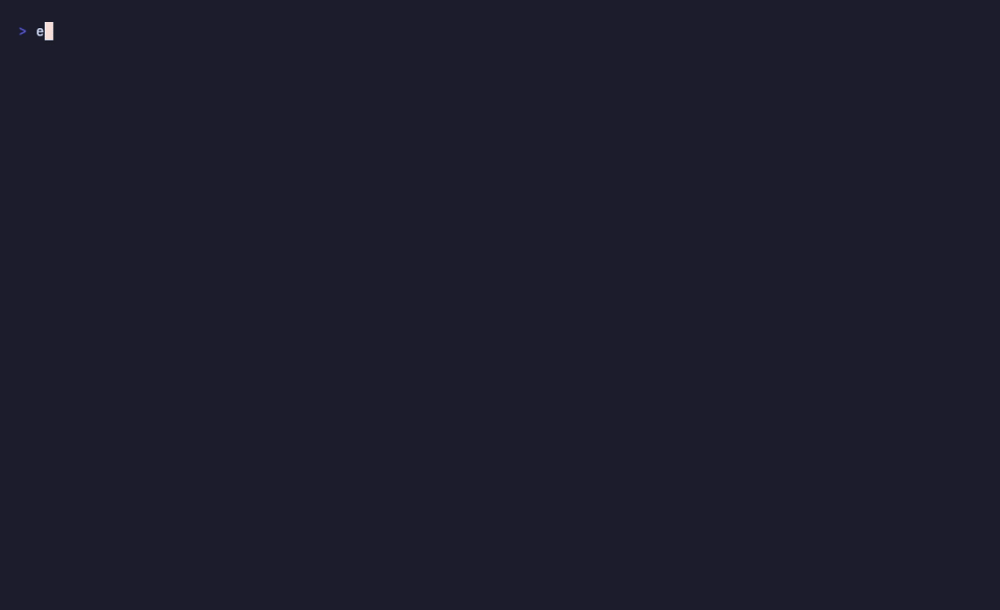

<p align="center">
  
</p>

<p align="center">
  <a href="https://crates.io/crates/galdr"></a>
  <a href="https://github.com/Arakiss/galdr/actions/workflows/ci.yml"></a>
  <a href="LICENSE"></a>
  
  
</p>

# galdr

> _galdr_ — Old Norse for a chanted spell: a sequence performed once and sung again.

**Record & Replay for agent skills.** Your agent just did a multi-step task well. Rather
than re-explain it next time, galdr records the *tool calls* it made and distills them into
a reusable **skill** the agent can replay with judgment. It runs entirely on your machine.

<p align="center">
  
</p>

## What galdr records

Most of what an agent does has no screen to record. Running tests, editing files, git,
deploys, API calls: each is already a structured tool call with its input and its result.
galdr records that trace and distills it into a skill the agent reads and applies, not a
verbatim re-run.

Some apps only live behind a GUI, with no API or CLI. There the agent uses Computer Use,
the same pixel-based control, and that is the right tool for the job. galdr captures those
sessions too: a click and a keystroke are tool calls, so it keeps the action and, by
default, drops the screenshot (you can opt in to keeping frames to help author the skill).

There is now a second human-observation lane for browser workflows:
`galdr observe browser start <name> --url <url>` launches an isolated Chrome/Chromium
profile, injects a local CDP sensor, and records navigation, clicks, form changes, and
submits as semantic human events. Typed text is redacted by default; screenshots are not
captured.

And a third lane observes native macOS apps: `galdr observe mac start <name>` installs a
listen-only event tap and records clicks, scrolls, and keystrokes. Each click carries the
accessibility context of the element under the cursor — its role, label, window title, and
owning app — so a distilled skill targets "the Send button", not a screen coordinate.
**Keystroke content is never captured**: a key is recorded only as an occurrence, never its
character or keycode, and capture is fully suspended whenever a secure input field (a
password) is focused. No screenshots. The raw capture is folded into the immutable span and
purged. It needs two macOS permissions (see below).

## Quickstart

```sh
cargo install galdr
galdr setup skill          # teach your harness how to drive galdr (once)

galdr rec start demo       # ● recording — now do the task with your agent
#  ... a few tool calls ...
galdr rec stop             # ■ stopped — 6 steps

galdr distill              # a faithful draft + an authoring brief; finish it with --from
```

No 26-character ids to copy — galdr resolves a recording by the latest, a name, or a short
prefix. Run `galdr` with no arguments for a one-screen overview of where you are.

## The loop

1. **Record** — start a recording, do the task with your agent, stop. Its tool calls are
   captured automatically; nothing to narrate. Recordings bind to the agent session that
   starts them, so parallel agents — say Claude Code and Codex side by side — each record
   their own task without crossing streams.
2. **Distill** — a replay of the tool calls is not yet a skill. `galdr distill` renders a
   faithful draft and hands the agent an authoring brief: supply the *why*, the inputs that
   vary, each step's intent, the gotchas. Install your version with `--from`. `--fast` takes
   the mechanical draft as-is; `--auto` lets a local model write it.
3. **Replay** — the skill is discoverable by name in every harness on the machine. Invoke it
   later with new inputs; interpret it, don't replay it verbatim.

## What else it does

- **`galdr observe browser`** — records a human-demonstrated browser workflow through a
  local CDP sensor, with typed values redacted and no screenshots by default.
- **`galdr observe mac`** (macOS) — records a native app demonstration through a listen-only
  event tap: clicks (with accessibility role/name/window/app), scrolls, and keystrokes as
  occurrences with no content. Needs two permissions — **Input Monitoring** (for the tap) and
  **Accessibility** (for element context) — granted in System Settings → Privacy & Security.
  `galdr doctor` reports whether each is granted. As a source-built CLI, the grant goes to your
  terminal, the same way tools like `skhd` and `yabai` are granted.
- **`galdr suggest`** — finds repeated tasks (the same shape across recordings) worth a skill.
- **`galdr bench`** — how reliably your skills replay, aggregated from the outcomes you record.
- **`galdr judge`** — ingests external per-step judgments (`ok` / `fork`) for closed
  recordings, summarizes measured fork points across attempts, and feeds those failure
  modes into distillation.
- **`galdr regress`** — pins regression base cases to a skill version hash, so an edited
  skill can be checked against the base cases that need real replay/review.
- **`galdr tui`** — a terminal UI: an Overview dashboard, then tabs for recordings, skills,
  and harnesses; read a `SKILL.md` or a recording's (noise-filtered) steps at a glance.
- **`galdr skills` / `galdr doctor`** — a small readiness-scored skill catalog, and a health
  check for your setup (including CLI↔daemon version skew and available updates).
- **`galdr rm`** — retire a skill: unlink it from every harness, move it to `.retired/`.
  Nothing is hard-deleted.
- **`galdr upgrade`** — self-update from crates.io, checked only when you ask (never in the
  background), restarting the daemon it manages. `--check` exits 10 when an update exists,
  for scripts.
- **`galdr daemon install`** — hand the daemon to launchd on macOS: starts at login,
  restarts on crash, survives upgrades. `uninstall` undoes it.
- Every read command takes `--json`, so an agent consumes galdr without scraping a table.

## One skill, every harness

galdr distills a skill once and links it into **every harness it finds**: Claude Code, Codex,
and Cursor. A skill recorded in one is discoverable in all of them. `galdr setup <harness>`
wires the sensor and prints the per-harness step, like trusting the hook in Codex.

## Local and private

- Everything lives on your machine: recordings and the catalog under `~/.galdr`, distilled
  skills in your local skill directories. galdr makes **no network egress**: it never phones
  home. The single opt-in exception, local-model distillation, talks **only to loopback**.
- The distiller redacts and generalizes the text it writes into a skill, and an install-time
  gate **refuses any skill that still contains secrets or personal paths**. Computer-Use
  screenshots are dropped by default (the action is kept, the screenshot isn't, for privacy).
  The raw recording itself is not redacted and can hold sensitive command output, so keep that
  in mind before sharing one. See [SECURITY.md](SECURITY.md).
- The recorder never breaks your agent session: if it fails internally it records nothing and
  exits cleanly.

## Install

```sh
cargo install galdr                                   # from crates.io
cargo install --git https://github.com/Arakiss/galdr  # from source
```

Or grab a prebuilt binary from a [release](https://github.com/Arakiss/galdr/releases/latest):
each ships signed and checksummed (Sigstore + SHA-256) with an SBOM, for macOS and Linux
(arm64 + x86_64).

## Roadmap

Shipped: the record → distill → replay loop with **author-by-default** distillation,
**`galdr suggest`** and **`galdr bench`**, an **Overview-led TUI**, multi-harness skills and
sensors (Claude Code, Codex, Cursor), **Human Browser Observe** for browser workflows,
**Native macOS Observe** (`galdr observe mac`) — clicks with accessibility context, scrolls,
and content-free keystrokes behind Input Monitoring + Accessibility — optional
**vision-assisted authoring** (keep screenshots ephemerally so the authoring pass writes
semantic GUI steps), a safe, redacted export path, **concurrent per-session recordings** for
multi-agent setups, full skill lifecycle (**`galdr rm`**), and a CLI that maintains itself
(**`galdr upgrade`**, launchd-managed daemon), **on-policy judgment ingestion** for measured
fork points, and a **regression base-case ledger** for skill edits.

Next: a live end-to-end recording verified in each harness, optional per-step screenshots for
the macOS lane, and a multi-agent broker over the same model.

## Contributing

See [CONTRIBUTING.md](CONTRIBUTING.md). Commits follow
[Conventional Commits](https://www.conventionalcommits.org/); the project uses
[Semantic Versioning](https://semver.org/).

## License

[MIT](LICENSE) © Petru Arakiss. Simple and permissive: use it, fork it, ship it.
